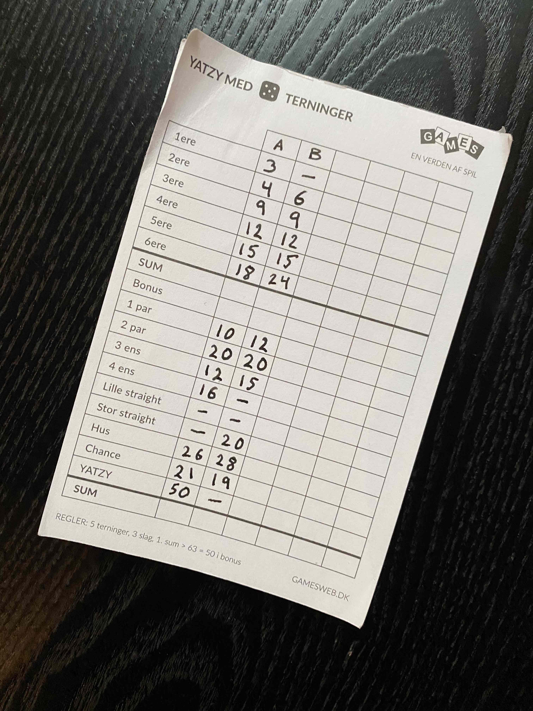
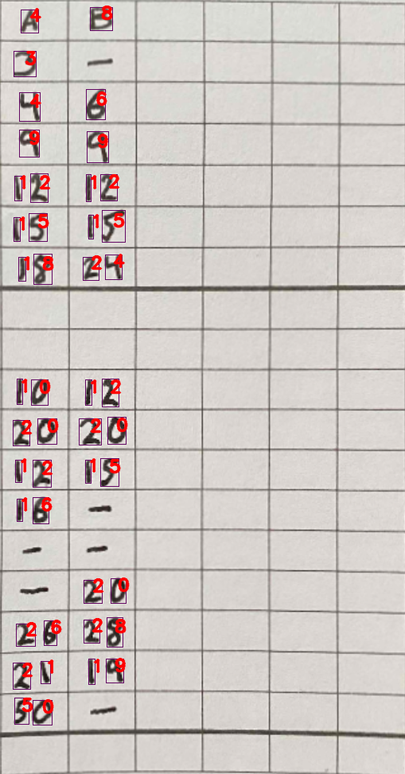
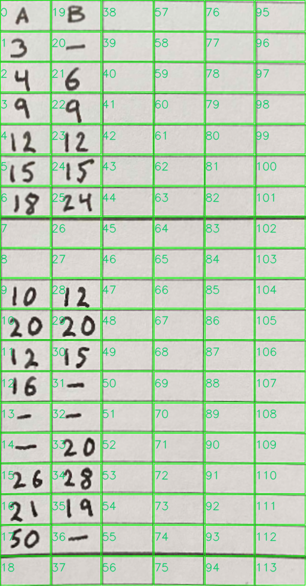
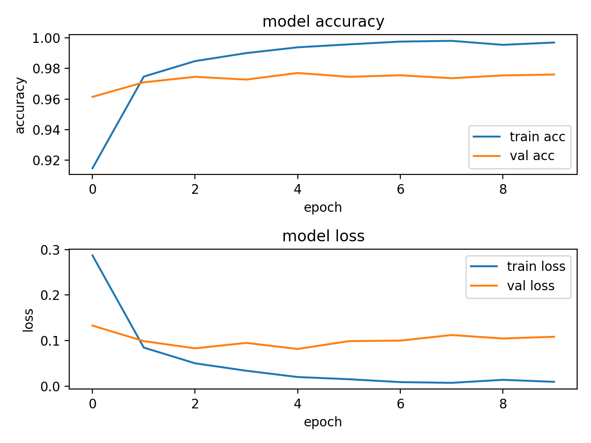
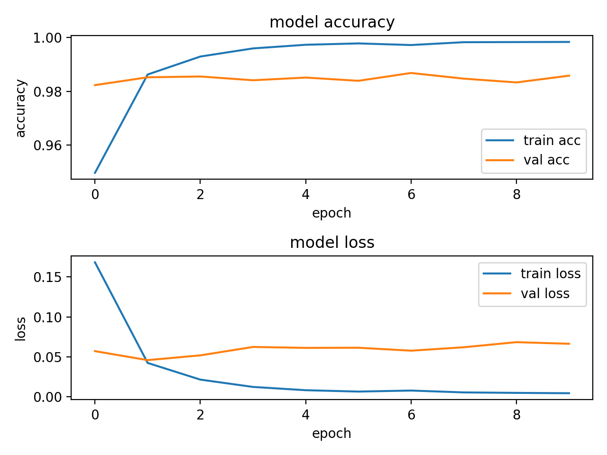
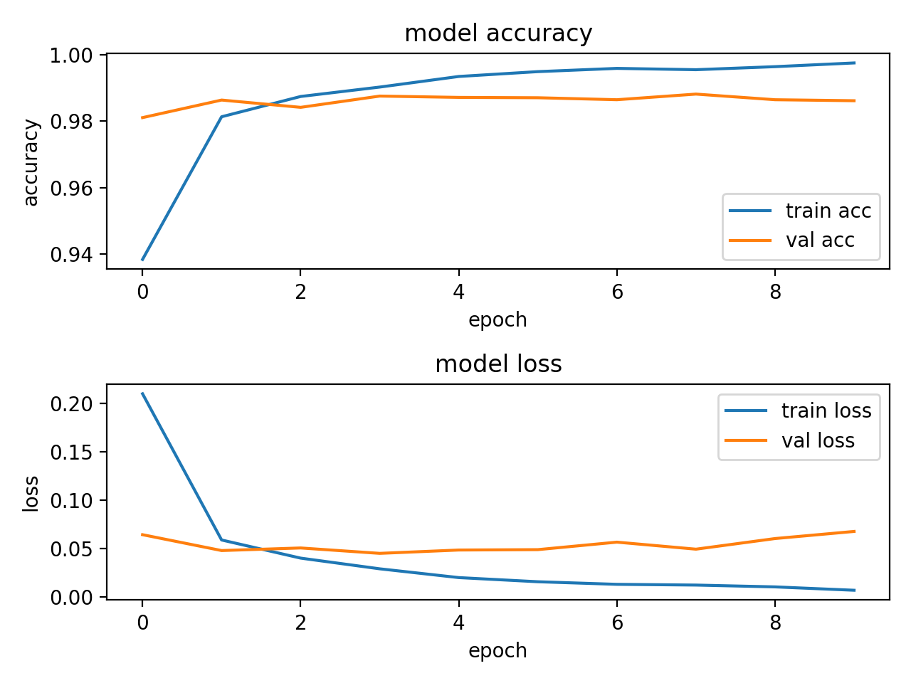
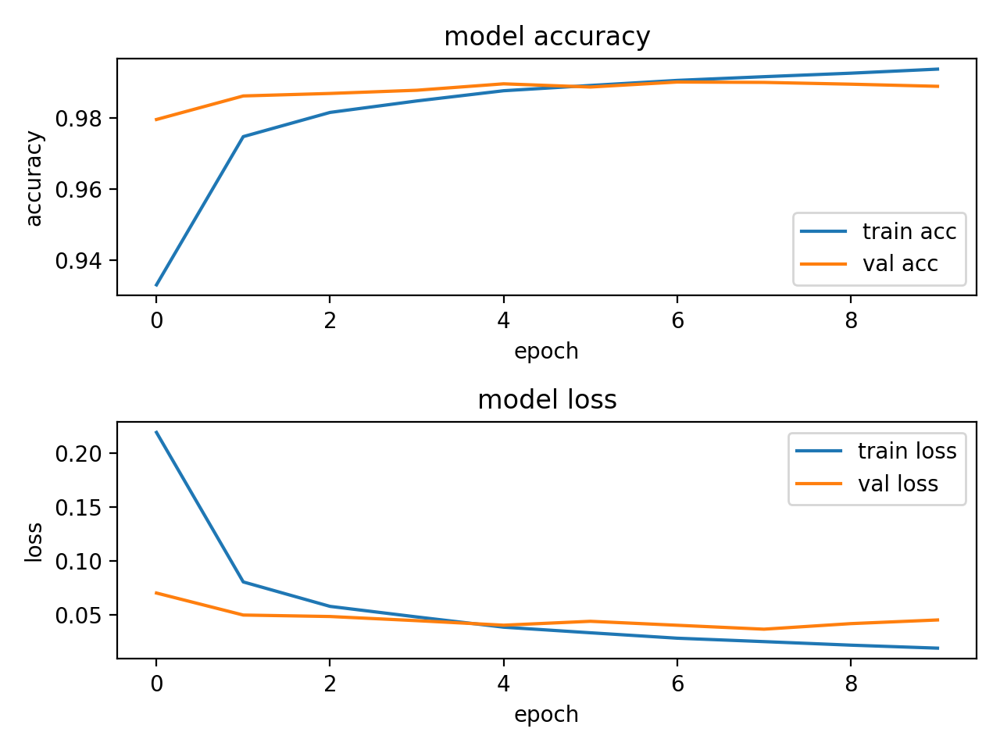
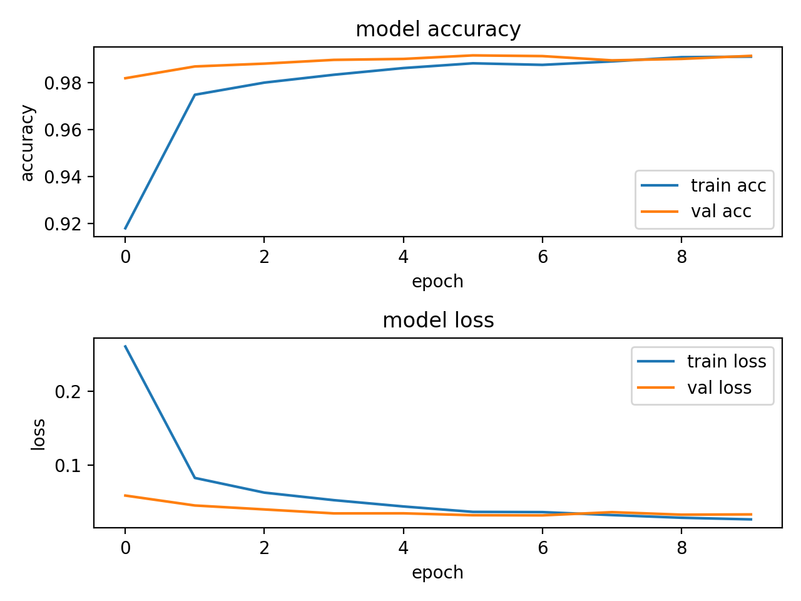

# Yatzy Score Sheet Detection

This is an implementation of a Yatzy score sheet detection in python utilizing <b>MNIST</b> dataset with tensorflow to identify handwritten digits. Various methods from `OpenCV` have been used in order to identify the grid. See `yatzy_sheet.py` for implementation details. This implementation is not optimized since some operations are duplicated on multiple versions of images in order to follow the implementation details easier.
Different steps are further explained in <a href="https://medium.com/@oankarberg/yatzy-score-sheet-detection-in-python-using-opencv-tensorflow-mnist-97ce685d80e0?source=friends_link&sk=0e4eb18e0a0f619a2af6c89bfb9c662d"> this </a> Medium article.

This code is ported (and optimized) to Objective C++ and the detection is running in <a href="https://apps.apple.com/se/app/yatzy-score-sheets/id1462576084" target="_blank" >Yatzy Score Sheet</a> on iOS.


The Yatzy Score Sheet app uses the camera buffer to check for the yatzy grid and proceeds with the handwritten recognition upon a successfully identified grid.

## To Run Detection

With `pipenv`

```
pipenv install
```

```
pipenv run python main.py
```

or

```
pipenv run python main.py --num_rows=19 --img_path='./assets/sample_sheets/sample_yatzy.jpg'
```

To run in `debug` mode and to verify the different steps to classify the yatzy sheet, run command with `--debug=true`

# Example

## Input image



## Outputs

To left: final classification

To right: identified grid. See `assets/output` for more intermediate steps.





# Training Network

The CNN that predicts the handwritten digits has a test accuracy of 99% and uses following architecture.

```
INPUT -> CONV3-32 -> RELU -> CONV3-32 -> RELU  -> CONV3-32 -> RELU -> POOL -> DROPOUT -> FC -> RELU -> DROPOUT -> SOFTMAX
```

To run

```
pipenv run python model/train.py
```

## Iterating to current network

See the graphs from iterating over the different network architectures. We see from the validation loss/accuracy that our network is reducing its overfitting even though our number of layers increase thanks to the `DROPOUT` and `POOLING` layers.

## #1

```
INPUT -> CONV3-32 -> RELU -> FC -> RELU -> SOFTMAX
```



## #2

```
INPUT -> CONV3-32 -> RELU -> CONV3-32 -> RELU -> FC -> RELU -> SOFTMAX
```



## #3

```
INPUT -> CONV3-32 -> RELU -> CONV3-32 -> RELU -> POOL -> FC -> RELU -> SOFTMAX
```



## #4

```
INPUT -> CONV3-32 -> RELU -> CONV3-32 -> RELU -> POOL -> DROPOUT ->  FC -> RELU -> SOFTMAX
```



## #5

```
INPUT -> CONV3-32 -> RELU -> CONV3-32 -> RELU  -> CONV3-32 -> RELU -> POOL -> DROPOUT -> FC -> RELU -> DROPOUT -> SOFTMAX
```


